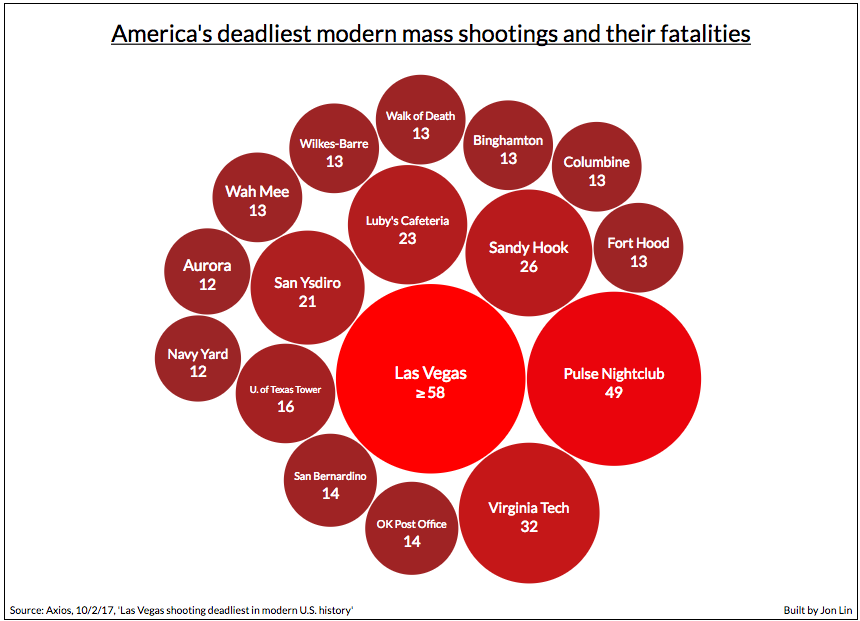
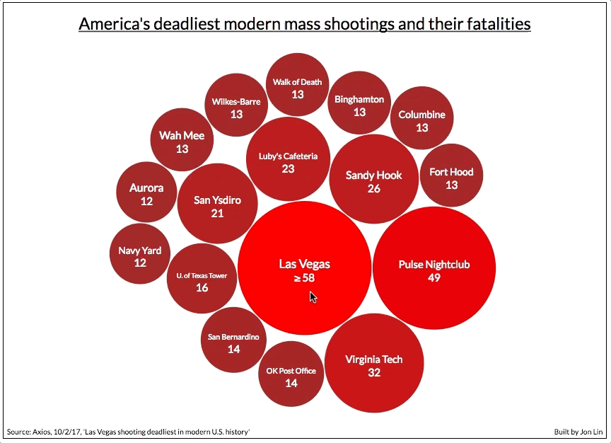

# U.S. Mass Shootings Data Visualization
* [Live link][live-link]

## Technologies Used
* D3.js (d3.pack, d3.hierarchy)
* vanilla JavaScript

## Screenshot

</img>

## GIF of Data Viz in Action

### Circles show dates and locations when hovered over. Clicking on a circle goes to the Wikipedia page about the shooting for additional info.

</img>

[live-link]: https://jon-lin.github.io/MassShootingsViz/
